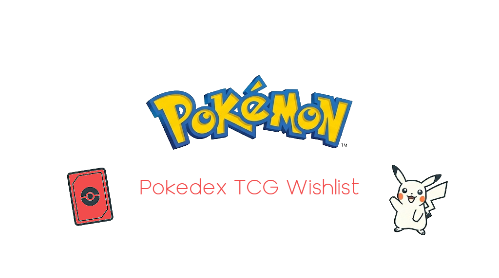

# 🃏 Pokédex TCG Wishlist

A clean, high-performance web application designed for Pokémon TCG collectors to search for specific card rarities across all 9 generations and generate a detailed shopping list (PDF) with real-time currency conversion.



## 🚀 Features

- **Multi-Region Support:** Filter Pokémon from Kanto (Gen 1) all the way to Paldea (Gen 9).
- **Advanced Rarity Filtering:** Search specifically for Promos, Hyper Rares (Gold), Special Illustration Rares, Ultra Rares, and more.
- **Interactive TCG Hover:** Hover over any Pokémon to fetch its special arts using the Pokémon TCG API.
- **Smart Wishlist:** Add your favorite cards to a local wishlist (saved in Browser Storage).
- **PDF Export:** Generate a professional report including:
  - Miniature card images.
  - Current market prices in USD.
  - Real-time USD to BRL conversion (via AwesomeAPI).
- **Modern UI:** Dark mode interface with a minimalist design and a persistent "hover bridge" fix for seamless card selection.

## 🛠️ Tech Stack

- **Frontend:** HTML5, CSS3 (Modern Flexbox/Grid), JavaScript (ES6+).
- **APIs:** - [PokeAPI](https://pokeapi.co/) (Pokémon data and sprites).
  - [Pokémon TCG API](https://pokemontcg.io/) (Card arts and pricing).
  - [AwesomeAPI](https://docs.awesomeapi.com.br/) (Real-time currency exchange).
- **Libraries:** - [jsPDF](https://github.com/parallax/jsPDF) (PDF generation).
  - [jsPDF-AutoTable](https://github.com/simonbengtsson/jsPDF-AutoTable) (PDF layout).

## 📋 How to use

1. Clone this repository:
   ```bash
   git clone [https://github.com/your-username/pokedex-tcg-wishlist.git](https://github.com/your-username/pokedex-tcg-wishlist.git)
